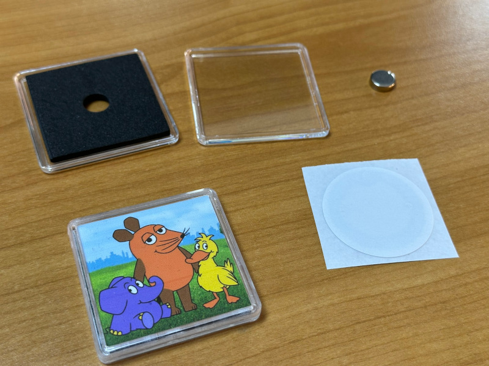

# TeddyCloud Cover Printer

A web-based tool for creating and printing custom NFC tag covers for your patched Toniebox. Design professional-looking covers for your TeddyCloud content with precision and ease.



🌐 **Website**: https://tcp.guided-traffic.com/

🐳 **Docker Image** (for self-hosting): https://hub.docker.com/repository/docker/hansfischer/cover-printer/general

## 🎯 Project Goals

- **Custom Toniebox Tags**: Create professional NFC tag covers for your TeddyCloud content
- **Perfect Print Quality**: 300 DPI output with exact dimensional accuracy for NFC tag labels
- **Easy Picture Alignment**: Intuitive drag-and-drop positioning with zoom controls
- **Privacy-First**: All processing happens client-side in the browser
- **No Backend Required**: Zero server dependencies or data uploads

## ✨ Key Features

- 🏷️ **TeddyCloud Integration**: Perfect for creating custom NFC tag covers for patched Tonieboxes
- 📐 Automatic layout calculation for optimal NFC tag cover placement
- 📄 Support for multiple paper sizes (10×15cm, 13×18cm photo paper)
- 🖼️ Drag & drop cover images directly from your computer
- 🔍 Zoom and pan to position cover art perfectly within tag boundaries
- ⚙️ Configurable tag dimensions, margins, and spacing (default: 45×45mm for standard NFC tags)
- 🖨️ Direct browser printing with accurate dimensions for precise cutting

## 🚀 Quick Start

```bash
# Install dependencies
npm install

# Start development server
npm start

# Navigate to http://localhost:4200
```

## 📋 Usage

1. **Configure**: Select paper size and enter NFC tag cover dimensions (default: 45×45mm for standard tags)
2. **Adjust**: Set margins and spacing between tag covers for easy cutting
3. **Add Cover Art**: Drag cover images from your computer onto the tag placeholders
4. **Position**: Click and drag to reposition cover art, use mouse wheel to zoom for perfect alignment
5. **Print**: Press Ctrl+P (Cmd+P on Mac) to print your custom TeddyCloud NFC tag covers
6. **Apply**: Cut out the covers and attach them to your NFC tags for your patched Toniebox

## 🛠️ Technical Details

- **Framework**: Angular
- **Language**: TypeScript
- **Target Browser**: Chrome (primary)
- **Print Resolution**: 300 DPI
- **Processing**: 100% client-side

## 📝 Project Scope

**In Scope:**
- Custom NFC tag cover creation for TeddyCloud/Toniebox
- Precise cover art positioning and printing
- Common image formats (JPG, PNG, WebP)
- Desktop browser experience
- Automatic grid layout optimization for efficient paper usage

**Out of Scope:**
- Mobile/tablet support
- State persistence between sessions
- Image editing (rotation, filters)
- PDF export functionality
- Multi-page layouts
- Direct NFC tag programming (use TeddyCloud for that)

## 📖 Documentation

For detailed implementation guidelines and architecture decisions, see [`.github/copilot-instructions.md`](.github/copilot-instructions.md).

## 📄 License

This project is licensed under the Apache 2.0 License.
